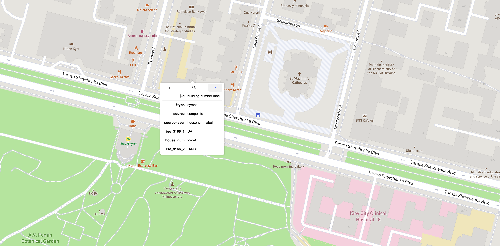
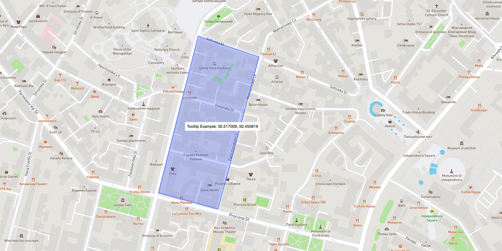

# Mapbox Controls

[](https://korywka.github.io/mapbox-gl-controls/)

### Usage

```bash
npm install mapbox-gl-controls
```

Include styles from package: `mapbox-gl-controls/lib/controls.css`

### Ruler Control [[options](https://github.com/korywka/mapbox-gl-controls/blob/master/src/RulerControl/RulerControl.ts#L19)]

```javascript
import { RulerControl } from 'mapbox-gl-controls';

map.addControl(new RulerControl(), 'top-right');
map.on('ruler.on', () => console.log('ruler: on'));
map.on('ruler.off', () => console.log('ruler: off'));

// with miles:
map.addControl(new RulerControl({
  units: 'miles',
  labelFormat: n => `${n.toFixed(2)} ml`,
}), 'top-right');
```

### Styles Control [[options](https://github.com/korywka/mapbox-gl-controls/blob/master/src/StylesControl/StylesControl.ts#L5)]

Adds style switcher similar to Google Maps.

```javascript
import { StylesControl } from 'mapbox-gl-controls';

// with default styles:
map.addControl(new StylesControl(), 'top-left');

// with custom styles:
map.addControl(new StylesControl({
  styles: [
    {
      label: 'Streets',
      styleName: 'Mapbox Streets',
      styleUrl: 'mapbox://styles/mapbox/streets-v9',
    }, {
      label: 'Satellite',
      styleName: 'Satellite',
      styleUrl: 'mapbox://styles/mapbox/satellite-v9',
    },
  ],
  onChange: (style) => console.log(style),
}), 'top-left');
```

### Compass Control [[options](https://github.com/korywka/mapbox-gl-controls/blob/master/src/CompassControl/CompassControl.ts#L5)]

```javascript
import { CompassControl } from 'mapbox-gl-controls';

map.addControl(new CompassControl(), 'top-right');
```

### Zoom Control

```javascript
import { ZoomControl } from 'mapbox-gl-controls';

map.addControl(new ZoomControl(), 'top-right');
```

### Language Control [[options](https://github.com/korywka/mapbox-gl-controls/blob/master/src/LanguageControl/LanguageControl.ts#L7)]

Localize map. Language can be set dynamically with `.setLanguage(lang)` method.

```javascript
import { LanguageControl } from 'mapbox-gl-controls';

// with browser detect:
map.addControl(new LanguageControl());

// with custom language:
const languageControl = new LanguageControl({
  language: 'ru',
});
map.addControl(languageControl);

// change language to multi language after control has been added:
languageControl.setLanguage('mul');
```

### Inspect Control

Inspect control to debug style layers and source



```javascript
import { InspectControl } from 'mapbox-gl-controls';

map.addControl(new InspectControl(), 'bottom-right');
```

### Tooltip Control [[options](https://github.com/korywka/mapbox-gl-controls/blob/master/src/TooltipControl/TooltipControl.ts#L4)]

Shows tooltip on hover on some layer or whole map.



```javascript
import { TooltipControl } from 'mapbox-gl-controls';

map.addLayer({
  id: '$fill',
  type: 'fill',
  source: { type: 'geojson', data: polygon },
  paint: { 'fill-opacity': 0.3, 'fill-color': '#4264fb' },
});

map.addControl(new TooltipControl({ layer: '$fill' }));
```
