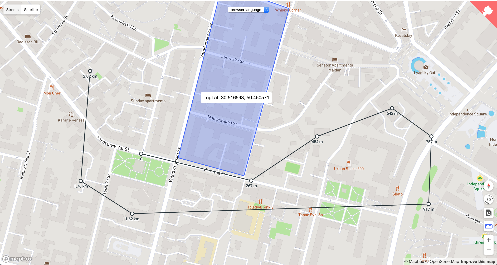

# Mapbox Controls

[](https://bravecow.github.io/mapbox-gl-controls/)

## Usage

### Install

```bash
npm install mapbox-gl-controls
```

### Include styles

```html
<link href="mapbox-gl-controls/theme.css" rel="stylesheet">
```

### Ruler Control

```javascript
import RulerControl from 'mapbox-gl-controls/lib/ruler';

map.addControl(new RulerControl(), 'top-right');
map.on('ruler.on', () => console.log('ruler: on'));
map.on('ruler.off', () => console.log('ruler: off'));

// with miles:
map.addControl(new RulerControl({
  units: 'miles',
  labelFormat: n => `${n.toFixed(2)} ml`,
}), 'top-right');
```

### Styles Control

```javascript
import StylesControl from 'mapbox-gl-controls/lib/styles';

// with default styles:
map.addControl(new StylesControl(), 'top-left');

// with custom styles:
map.addControl(new StylesControl({
  styles: [
    {
      label: 'Streets',
      styleName: 'Mapbox Streets',
      styleUrl: 'mapbox://styles/mapbox/streets-v9',
    }, {
      label: 'Satellite',
      styleName: 'Satellite',
      styleUrl: 'mapbox://styles/mapbox/satellite-v9',
    },
  ],
  onChange: (style) => console.log(style),
}), 'top-left');
```

### Compass Control

```javascript
import CompassControl from 'mapbox-gl-controls/lib/compass';

map.addControl(new CompassControl(), 'top-right');
```

### Zoom Control

```javascript
import ZoomControl from 'mapbox-gl-controls/lib/zoom';

map.addControl(new ZoomControl(), 'top-right');
```

### Language Control

```javascript
import LanguageControl from 'mapbox-gl-controls/lib/language';

// with browser detect:
map.addControl(new LanguageControl());

// with custom language:
const languageControl = new LanguageControl({
  language: 'ru',
});
map.addControl(languageControl);

// change language to multi language after control has been added:
languageControl.setLanguage('mul');
```

### Inspect Control

```javascript
import InspectControl from 'mapbox-gl-controls/lib/inspect';

map.addControl(new InspectControl(), 'bottom-right');
```

### Tooltip Control

```javascript
import TooltipControl from 'mapbox-gl-controls/lib/tooltip';

map.addControl(new TooltipControl({ layer: '$fill' }));
```

### API

<!-- Generated by documentation.js. Update this documentation by updating the source code. -->

#### AroundControl

Set pitch to 60 and rotate a little camera with easing.

##### Parameters

-   `options` **[Object](https://developer.mozilla.org/docs/Web/JavaScript/Reference/Global_Objects/Object)**  (optional, default `{}`)
    -   `options.minZoom` **[Number](https://developer.mozilla.org/docs/Web/JavaScript/Reference/Global_Objects/Number)?** Minimal zoom while rotation
    -   `options.center` **[Array](https://developer.mozilla.org/docs/Web/JavaScript/Reference/Global_Objects/Array)?** Fly to center while rotation

#### CompassControl

Simple compass

##### Parameters

-   `options` **[Object](https://developer.mozilla.org/docs/Web/JavaScript/Reference/Global_Objects/Object)**  (optional, default `{}`)
    -   `options.instant` **[Boolean](https://developer.mozilla.org/docs/Web/JavaScript/Reference/Global_Objects/Boolean)** Show compass if bearing is 0 (optional, default `true`)

#### InspectControl

Inspect control to debug style layers and source

#### LanguageControl

Localize map. Language can be set dynamically with `.setLanguage(lang)` method.

##### Parameters

-   `options` **[Object](https://developer.mozilla.org/docs/Web/JavaScript/Reference/Global_Objects/Object)**  (optional, default `{}`)
    -   `options.supportedLanguages` **[Array](https://developer.mozilla.org/docs/Web/JavaScript/Reference/Global_Objects/Array)?** (Supported languages)[https://docs.mapbox.com/help/troubleshooting/change-language/]
    -   `options.language` **[String](https://developer.mozilla.org/docs/Web/JavaScript/Reference/Global_Objects/String)?** One of the supported languages to apply
    -   `options.excludedLayerIds` **[Array](https://developer.mozilla.org/docs/Web/JavaScript/Reference/Global_Objects/Array)** Array of layer id to exclude from localization (optional, default `[]`)
    -   `options.getLanguageField` **[Function](https://developer.mozilla.org/docs/Web/JavaScript/Reference/Statements/function)?** Accepts language and returns language field
        By default fields are `name_LANGUAGE` and `name` for multi language (mul)

#### RulerControl

Fires map `ruler.on` and `ruler.off`events at the beginning and at the end of measuring.

##### Parameters

-   `options` **[Object](https://developer.mozilla.org/docs/Web/JavaScript/Reference/Global_Objects/Object)**  (optional, default `{}`)
    -   `options.units` **[String](https://developer.mozilla.org/docs/Web/JavaScript/Reference/Global_Objects/String)** Any units [@turf/distance](https://github.com/Turfjs/turf/tree/master/packages/turf-distance) supports (optional, default `'kilometers'`)
    -   `options.labelFormat` **[Function](https://developer.mozilla.org/docs/Web/JavaScript/Reference/Statements/function)?** Accepts number and returns label.
        Can be used to convert value to any measuring units
    -   `options.font` **[Array](https://developer.mozilla.org/docs/Web/JavaScript/Reference/Global_Objects/Array)** Array of fonts. (optional, default `['Roboto Medium']`)

#### StylesControl

Adds style switcher similar to Google Maps.

##### Parameters

-   `options` **[Object](https://developer.mozilla.org/docs/Web/JavaScript/Reference/Global_Objects/Object)**  (optional, default `{}`)
    -   `options.styles` **[Array](https://developer.mozilla.org/docs/Web/JavaScript/Reference/Global_Objects/Array)?** Array of style objects:
        -   `options.styles.label` **[String](https://developer.mozilla.org/docs/Web/JavaScript/Reference/Global_Objects/String)** Style label to display on switcher
        -   `options.styles.styleName` **[String](https://developer.mozilla.org/docs/Web/JavaScript/Reference/Global_Objects/String)** [Style name from spec](https://docs.mapbox.com/mapbox-gl-js/style-spec/#root-name)
        -   `options.styles.styleUrl` **[String](https://developer.mozilla.org/docs/Web/JavaScript/Reference/Global_Objects/String)** Style url
    -   `options.onChange` **[Function](https://developer.mozilla.org/docs/Web/JavaScript/Reference/Statements/function)?** Triggered on style change. Accepts `style` object

#### TooltipControl

Shows tooltip on hover on some layer or whole map.

##### Parameters

-   `options` **[Object](https://developer.mozilla.org/docs/Web/JavaScript/Reference/Global_Objects/Object)**  (optional, default `{}`)
    -   `options.layer` **[String](https://developer.mozilla.org/docs/Web/JavaScript/Reference/Global_Objects/String)** Layer id to show the tooltip on hover.
        If not specified, tooltip will be shown for whole map container
    -   `options.getContent` **[Function](https://developer.mozilla.org/docs/Web/JavaScript/Reference/Statements/function)?** Triggered each time mouse moved over `layer` option.
        Accepts `event` object

#### ZoomControl

Simple zoom control
