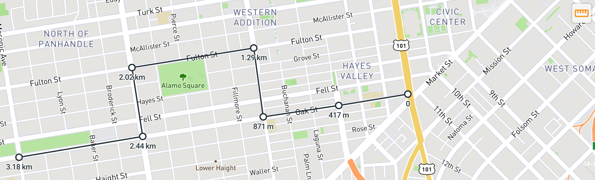
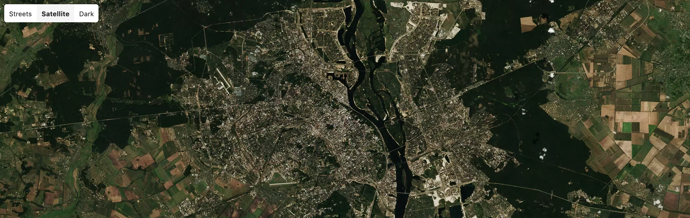
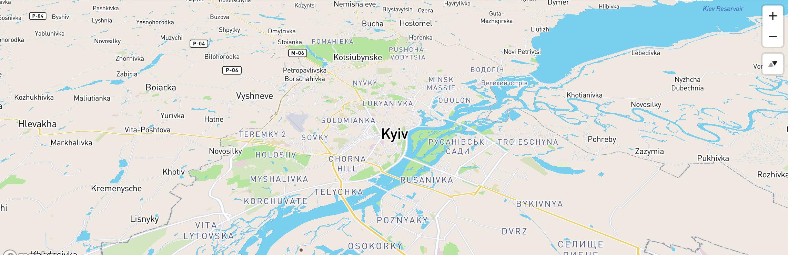

# Mapbox Controls

### Installing

```
npm install mapbox-gl-controls
```

Include styles:

```html
<link href="theme.css" rel="stylesheet">
```

### Ruler Control

Ruler is similar to Google Maps Ruler. With draggable points.



### Style Control

Google maps-like styles switcher.



### Zoom and Compass Controls

Zoom and Compass are split to two different controls. Compass is visible only after map has been rotated.


